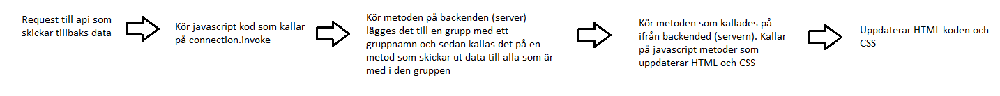

# Fronten Documentation

## RazorPages
För att hämta rätt data till sidan man är på används OnGet(). Den datan används för att skriva ut alla element för den sidan.

## HTML
Det används för att bygga upp sidorna.

## JavaScript, JQuery
Vi använder JavaScript för att göra requests till api:et och för att hantera datan som vi får tillbaks.  
Det används även för att sätta olika värden och attributer på element.

JQuery används för att göra spelet mer interaktivt genom att få värden från olika element man klickar på.

## CSS
Stylar alla element på de respektive sidorna.

## SignalR
[SignalR tutorial](https://docs.microsoft.com/sv-se/aspnet/core/tutorials/signalr?tabs=visual-studio&view=aspnetcore-5.0)  
[SignalR documentation](https://docs.microsoft.com/en-us/aspnet/signalr/)

Används för att uppdatera HTML för alla spelare som är inne i samma spel.

### Flowshart för SignalR data

