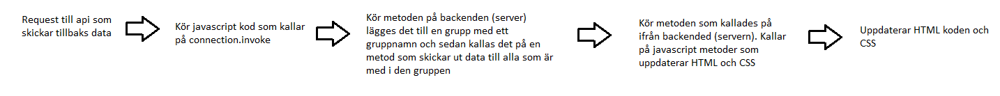

# SignalR
[SignalR tutorial](https://docs.microsoft.com/sv-se/aspnet/core/tutorials/signalr?tabs=visual-studio&view=aspnetcore-5.0)  
[SignalR documentation](https://docs.microsoft.com/en-us/aspnet/signalr/)

Används för att uppdatera HTML för alla spelare som är inne i samma spel.

## Flowshart för SignalR data

